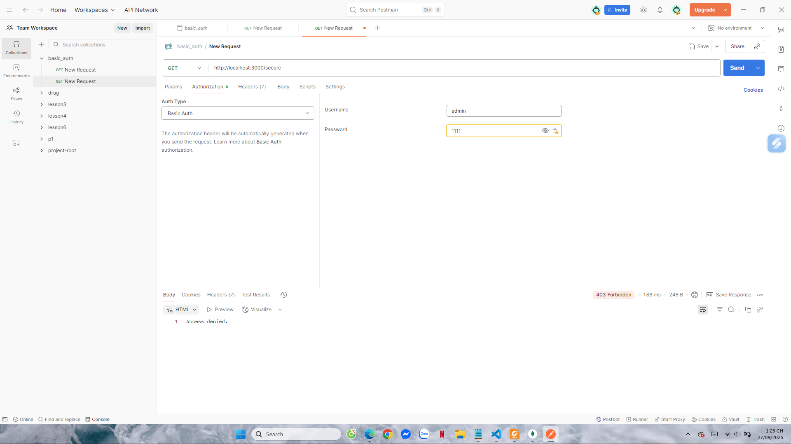
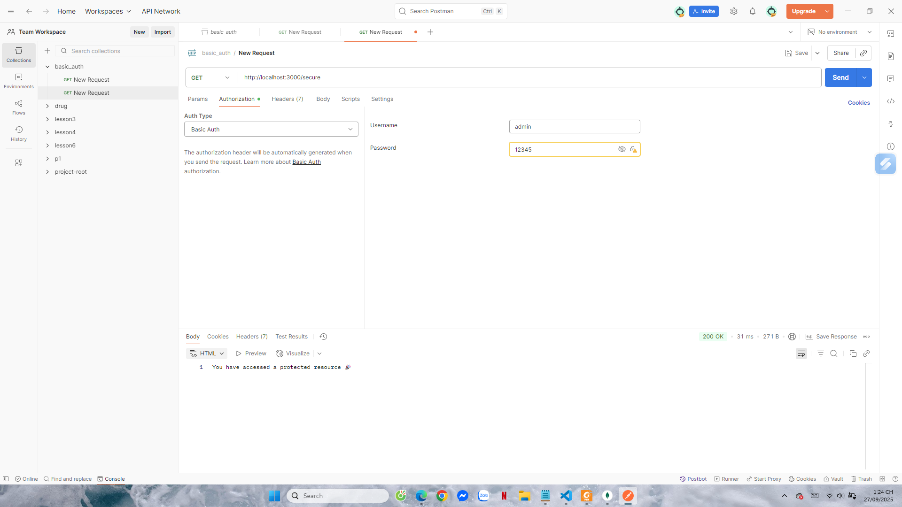
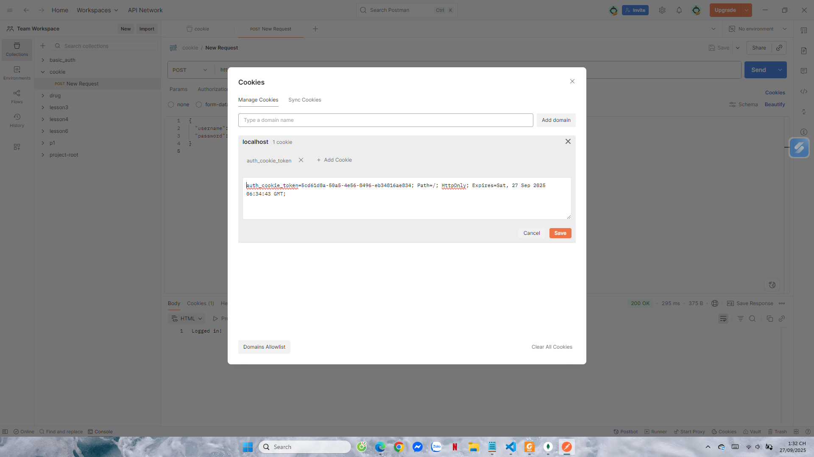
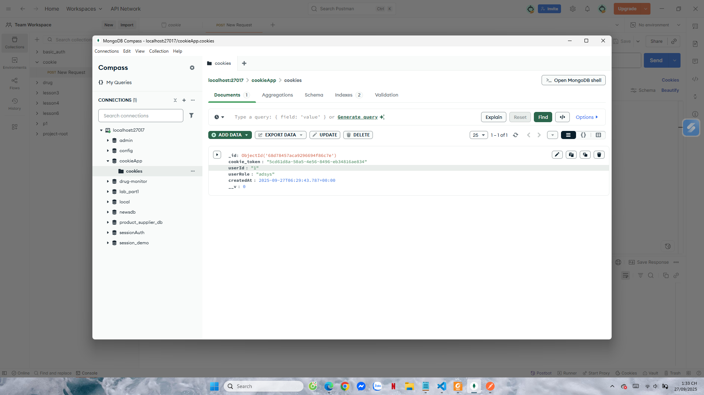
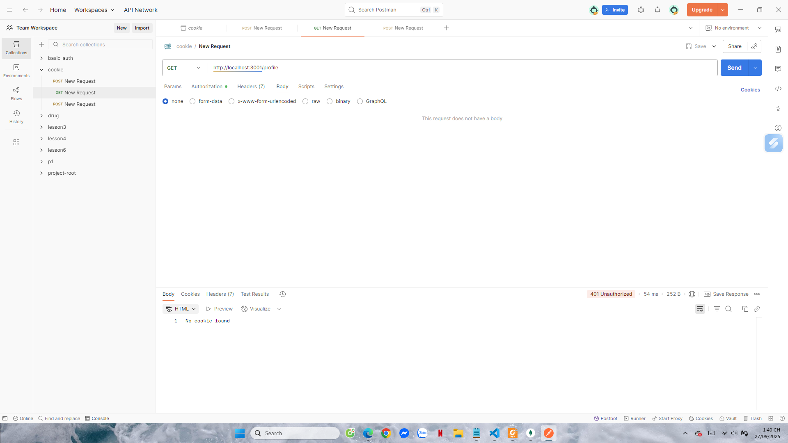
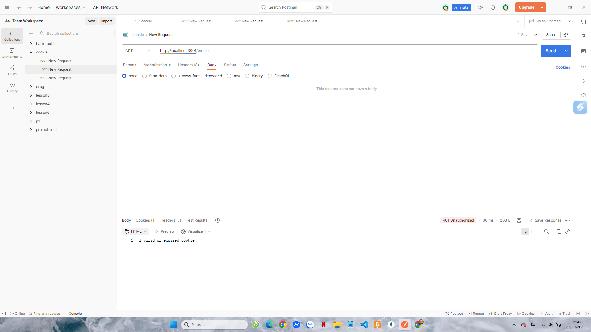
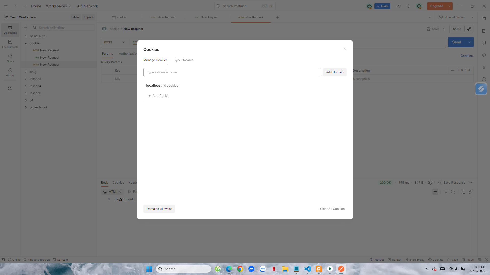
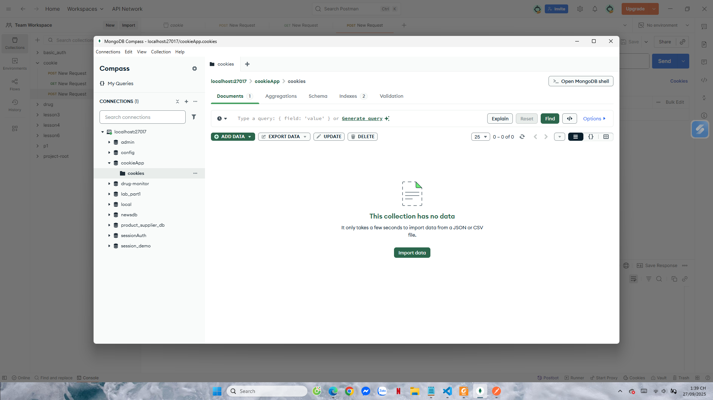

# Project 1: Simple Authentication

## Cách chạy
Cài đặt dependencies:
```bash
npm install
```

Chạy server Basic Auth:
```bash
node basic_auth.js
```

Chạy server Cookie Auth:
```bash
node cookie_auth.js
```

---

## Part A: Basic Auth (`basic_auth.js`)

### Public Routes
- `GET /` → không cần đăng nhập  
- `GET /public` → không cần đăng nhập  

### Secure Route
- `GET /secure` → yêu cầu Basic Auth  
  - Username: `admin`  
  - Password: `12345`  

### Kết quả test
- **Không gửi Authorization**  
    

- **Sai username/password**  
    

- **Đúng username/password**  
    

---

## Part B: Cookie Auth (`cookie_auth.js`)

### 1. Login
Request:
```http
POST /login
Content-Type: application/json
{
  "username": "admin",
  "password": "12345"
}
```

Kết quả:
- Response: `"Logged in!"`  
- Tab Cookies trong Postman có `auth_cookie_token`  
- MongoDB collection `cookies` có record mới  

Ảnh test:  
  
  

---

### 2. Profile
Request:
```http
GET /profile
```

Kết quả test:
- Chưa login → `401 No cookie found`  
    

- Cookie sai/hết hạn → `401 Invalid or expired cookie`  
    

- Cookie hợp lệ → trả về thông tin user  
    

---

### 3. Logout
Request:
```http
POST /logout
```

Kết quả: Cookie bị xóa ở client & trong MongoDB  

Ảnh test:  
  
  

---

## Hoàn thành
- `basic_auth.js` → xác thực bằng Basic Auth header  
- `cookie_auth.js` → xác thực bằng Cookie + lưu session trong MongoDB  

Ảnh minh họa test đều nằm trong thư mục:
```
public/results/
```
